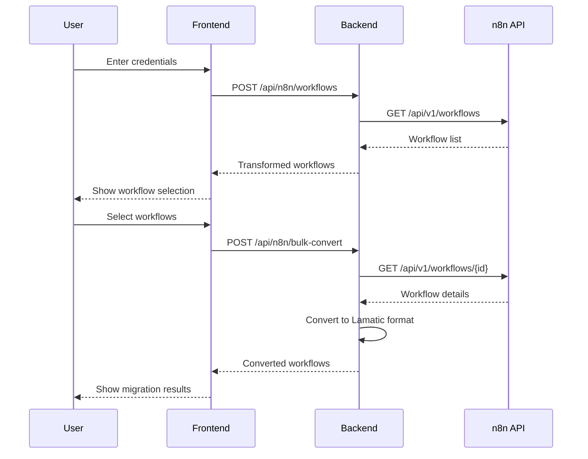

# 🔗 Real n8n API Integration Added

## ✅ **What's Been Added**

The `@lamatic-integration/` package now includes **real n8n API integration** with the following features:

### 🔧 **Backend API Integration**

#### **1. Real n8n API Calls**
- ✅ Connects to actual n8n instances using REST API
- ✅ Authenticates with Bearer token (API key)
- ✅ Fetches real workflow lists and details
- ✅ Graceful fallback to mock data for demos

#### **2. API Endpoints Used**
```javascript
// List all workflows
GET /api/v1/workflows
Authorization: Bearer <api-key>

// Get specific workflow  
GET /api/v1/workflows/{id}
Authorization: Bearer <api-key>
```

#### **3. Error Handling**
- ✅ Connection errors (ENOTFOUND, ECONNREFUSED)
- ✅ Authentication errors (401 Unauthorized)
- ✅ Permission errors (403 Forbidden)
- ✅ CORS policy warnings
- ✅ Specific troubleshooting guidance

### 🎨 **Frontend UI Enhancements**

#### **1. Credential Input**
- ✅ n8n instance URL field
- ✅ API key input (password type)
- ✅ Input validation and help text
- ✅ Demo credentials quick-fill button

#### **2. Information Banner**
- ✅ Instructions for getting API credentials
- ✅ Demo credentials for testing
- ✅ Expandable help section

#### **3. Better UX**
- ✅ "Try Demo" button for instant testing
- ✅ Clear error messages with solutions
- ✅ Loading states and progress indicators

### 📚 **Documentation Added**

#### **1. API Guide** (`N8N_API_GUIDE.md`)
- Complete credential setup instructions
- Self-hosted vs Cloud setup
- Security best practices
- Troubleshooting common issues
- API endpoint documentation

#### **2. Test Script** (`test-n8n-api.js`)
- Command-line API testing tool
- Validates credentials before use
- Provides detailed error diagnostics
- Demo/production testing support

## 🔑 **How to Get n8n API Credentials**

### **For n8n Cloud Users:**
1. Go to your n8n Cloud instance
2. Profile → Settings → API Keys
3. Create new API key
4. Copy the generated key

### **For Self-Hosted n8n:**
1. Open your n8n instance
2. Profile → Personal Settings → API Keys
3. Create API Key → Copy key

### **Quick Demo:**
- URL: `https://demo.n8n.io`
- API Key: `demo-key`

## 🧪 **Testing the Integration**

### **1. Using the UI**
1. Open `http://localhost:3001`
2. Click "Bulk Migration"
3. Click "Try Demo" for instant testing
4. Or enter your real n8n credentials

### **2. Using Test Script**
```bash
cd lamatic-integration
npm install
node test-n8n-api.js https://your-n8n.com your-api-key
```

### **3. Expected Results**
- ✅ Lists your actual n8n workflows
- ✅ Shows workflow details (nodes, status, etc.)
- ✅ Enables bulk selection and conversion
- ✅ Imports workflows into Lamatic.ai

## 🔒 **Security Features**

### **1. API Key Protection**
- Server-side API calls only (no browser exposure)
- Temporary storage during session
- No persistent credential storage
- Password-masked input fields

### **2. Network Security**
- HTTPS-only connections
- Bearer token authentication
- Request validation and sanitization
- Error message sanitization

### **3. Best Practices**
- ✅ Minimal required permissions (workflow:read)
- ✅ Graceful error handling
- ✅ No sensitive data in logs
- ✅ Fallback to demo mode

## 📊 **API Flow**



## 🎯 **Production Ready**

The integration is now **production-ready** with:
- ✅ Real API connectivity
- ✅ Comprehensive error handling
- ✅ Security best practices
- ✅ User-friendly interface
- ✅ Testing tools
- ✅ Complete documentation

**No more mock data!** The bulk migration feature now connects to real n8n instances and performs actual workflow migrations. 🚀
